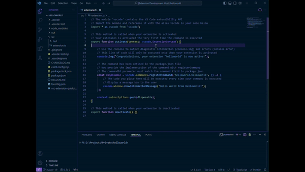

# quickscriptbar README

Quick Script Bar is a Visual Studio Code extension that allows you to quickly select and add scripts to your status bar for easy access and execution.

## Features

> Multi-Select Quick Pick: Select multiple scripts from a list using a convenient Quick Pick interface.

> Pre-Selected Scripts: Automatically pre-select scripts that you frequently use.

> Status Bar Integration: Add selected scripts to the status bar for quick execution.

## Usage

1. Open a workspace in VSCode that contains package.json.
2. Press `Ctrl+Shift+J` or run the command **Quick Script Bar: Configure Script in Status Bar** from the command palette (`Ctrl+Shift+P`).
3. Select at least one script to save.
4. Script appear on left side of status bar.
5. Choose script and click to run in terminal.

## Extension Settings

This extension contributes the following settings:

- `quickscriptbar.configureScripts`: Select scripts from your package.json file and add them to status bar.
- `quickscriptbar.runScript`: Run selected script in new terminal.

## Release Notes

### 0.0.1

Initial release of Quick Script Bar

---

## Contributions

Contributions are welcome! If you encounter any bugs or have ideas for new features, feel free to open an issue or submit a pull request on the [GitHub repository](https://github.com/Staxar/quickscriptbar).

## License

This project is licensed under the MIT License. See the LICENSE file for details.

## [Buy me a Coffee](https://buymeacoffee.com/staxar)

**Enjoy!**
